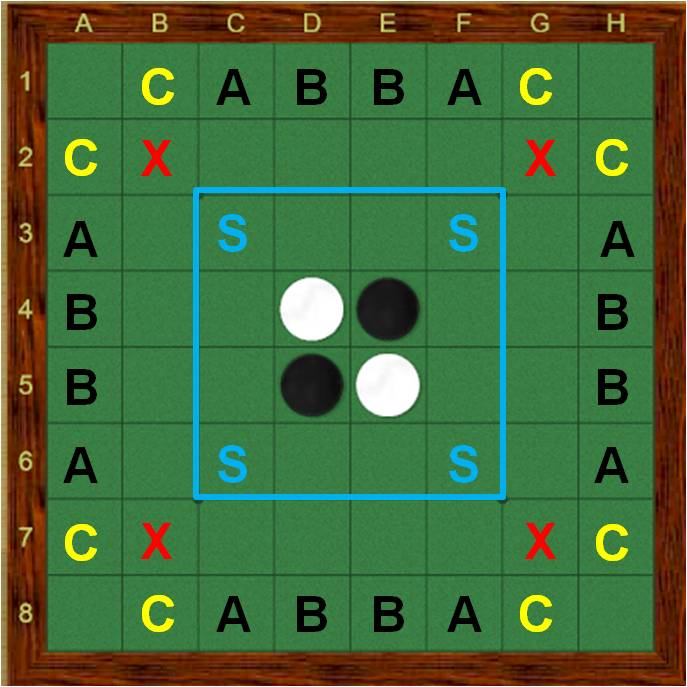

# Reversi

An implementation of the game Reversi (Othello) in F#



- Install dotnet framework
- Install nodejs

```sh
$ ./reversi.api/dotnet restore
$ ./reversi.api/dotnet run

$ ./reversi.web/npm install
$ ./reversi.web/npm start
```

## Machine Learning

Reinforcement learning, where the goal is known but path isn't. Python or AWS?

https://github.com/rlcode/reinforcement-learning/blob/master/1-grid-world/5-q-learning/q_learning_agent.py
https://github.com/google/dopamine
https://www.tensorflow.org